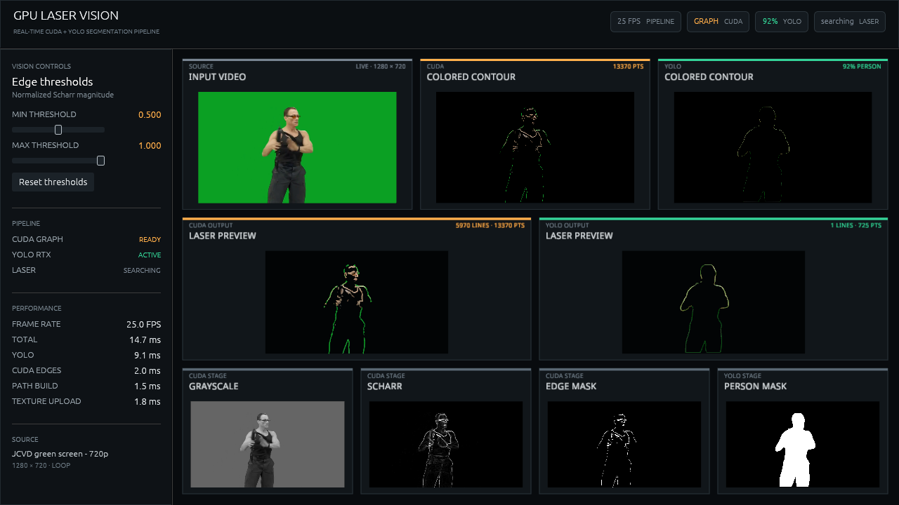
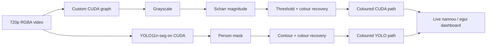

<div align="center">

# GPU Laser Vision

**Real-time Rust GPU vision that turns live video into coloured vector paths.**

[](https://www.rust-lang.org/)
[](https://developer.nvidia.com/cuda-toolkit)
[](https://pytorch.org/)
[](https://nixos.org/)
[](LICENSE)

</div>

[](docs/media/demo.mp4)

GPU Laser Vision compares two live 720p pipelines side by side: a custom CUDA
edge detector and CUDA-backed YOLO11 instance segmentation. Both recover source
colours, extract contours, and produce normalized paths compatible with
`nannou_laser` while the interface exposes every stage and its measured cost.

## Live demo

[Watch the complete 1080p H.264 recording](docs/media/demo.mp4) · 3:01 at 25 FPS,
captured from the release build with every preview updating on every source
frame and encoded with HandBrake.

## At a glance

| | Release measurement |
|---|---:|
| Input | 1280 × 720 RGBA video at 25 FPS |
| Delivered rate | **24.8–25.2 FPS** |
| Processing callback | **14.8–15.6 ms** |
| YOLO11n segmentation | 9.1–10.1 ms |
| Custom CUDA edge pipeline | 1.8–1.9 ms |
| Display texture updates | 1.9 ms |
| Test GPU | NVIDIA GeForce RTX 5090 |

The media is the limiting clock: the measured callback has approximately
64–68 FPS of compute capacity, but a 25 FPS file cannot deliver additional
unique frames. See [the profiling notes](docs/profiling.md) for methodology,
stage breakdowns, and the Nsight Scharr experiment.

## Architecture



### Custom CUDA path

1. Convert packed RGBA pixels to normalized luminance.
2. Compute Scharr magnitude and horizontal/vertical gradients.
3. Apply the live threshold range and sample a strong source colour across the
   gradient normal.
4. Copy compact display outputs into pinned host memory.
5. Trace active mask pixels into open paths, closed loops, and isolated points.

The kernels run as a captured CUDA graph with persistent device buffers.
Threshold values are uploaded only when the controls change.

### Neural path

1. Upload, resize, normalize, and letterbox the frame on CUDA.
2. Run the fixed 640 × 640 YOLO11n-seg TorchScript model with LibTorch.
3. Decode the strongest COCO `person` instance and restore its mask to 720p.
4. Extract a one-pixel contour and replace green spill with nearby foreground
   colour.
5. Feed the same path tracer used by the classical pipeline.

This keeps the comparison honest: the two pipelines differ in perception, then
share the same colour, geometry, display, and point-count surfaces.

## Run it

### Requirements

- Linux or WSL2 with an NVIDIA GPU and working host driver
- [Nix](https://nixos.org/download/) with flakes enabled
- Git and internet access for the first dependency/model fetch

CUDA, nightly Rust, LibTorch/PyTorch 2.11, FFmpeg, `uv`, and the native windowing
libraries are pinned by `flake.nix`. No system CUDA toolkit is required.

```bash
git clone https://github.com/JoshuaBatty/gpu-laser-vision.git
cd gpu-laser-vision

# Download YOLO11n-seg and export the fixed TorchScript artifact.
nix develop --command uv run scripts/export_yolo.py

# Build the CUDA kernels and launch the release application.
nix develop --command cargo oxide run
```

The first build compiles the CUDA codegen backend and LibTorch C++ bridge, so it
is substantially slower than subsequent launches.

The tracked Big Buck Bunny sample is used by default. A local
`assets/jcvd_green_screen_720p.mp4` overrides it when present; that clip is
intentionally gitignored. The generated `.pt` and `.torchscript` model files are
also ignored and can always be regenerated by the export script.

## Interface

- **Edge thresholds** adjust the inclusive normalized Scharr range in real time.
- **CUDA / YOLO cards** compare coloured contours and generated paths.
- **Diagnostics** expose grayscale, Scharr, edge-mask, and person-mask stages.
- **Performance** reports rolling FPS and per-stage callback timings.
- **Status chips** show CUDA graph, YOLO confidence, and Ether Dream discovery.

All previews retain their 16:9 source geometry and update on every decoded
frame. The dashboard has been verified live at 1280 × 720 and 1920 × 1080.

## Repository map

| Path | Responsibility |
|---|---|
| [`src/edge_detection.rs`](src/edge_detection.rs) | Persistent CUDA graph, buffers, and host reconstruction |
| [`src/kernels.rs`](src/kernels.rs) | Grayscale, Scharr, threshold, and colour-recovery kernels |
| [`src/yolo.rs`](src/yolo.rs) | TorchScript inference, mask decoding, and contour colourization |
| [`src/path_generation.rs`](src/path_generation.rs) | Mask graph traversal and normalized laser geometry |
| [`src/laser.rs`](src/laser.rs) | Ether Dream discovery and background frame streaming |
| [`src/interface.rs`](src/interface.rs) | Responsive dashboard layout and visual primitives |
| [`docs/profiling.md`](docs/profiling.md) | End-to-end and isolated-kernel measurements |
| [`scripts/export_yolo.py`](scripts/export_yolo.py) | Reproducible Ultralytics → TorchScript export |

## Current boundary

The application already generates both live path sets and previews them on
screen. Ether Dream discovery and streaming are implemented, but the current
hardware worker is seeded with the startup test path. Selecting a live CUDA or
YOLO path for physical output, adding projector output, and recording the final
source → GPU → light installation are the next phase.

Laser hardware requires appropriate scan limits, blanking, interlocks, and
venue-specific safety controls. The on-screen paths alone should not be treated
as a complete laser-safety system.

## License and attribution

This project is released under the [GNU Affero General Public License v3.0](LICENSE).

The model export workflow uses [Ultralytics YOLO](https://github.com/ultralytics/ultralytics),
and the generated YOLO11 model is subject to Ultralytics' AGPL-3.0 terms unless
covered by a separate enterprise license. Model weights are not committed.

The bundled fallback video is **Big Buck Bunny**, copyright 2008 Blender
Foundation, distributed under CC BY 3.0. Full details are in
[`assets/BIG_BUCK_BUNNY_ATTRIBUTION.md`](assets/BIG_BUCK_BUNNY_ATTRIBUTION.md).
